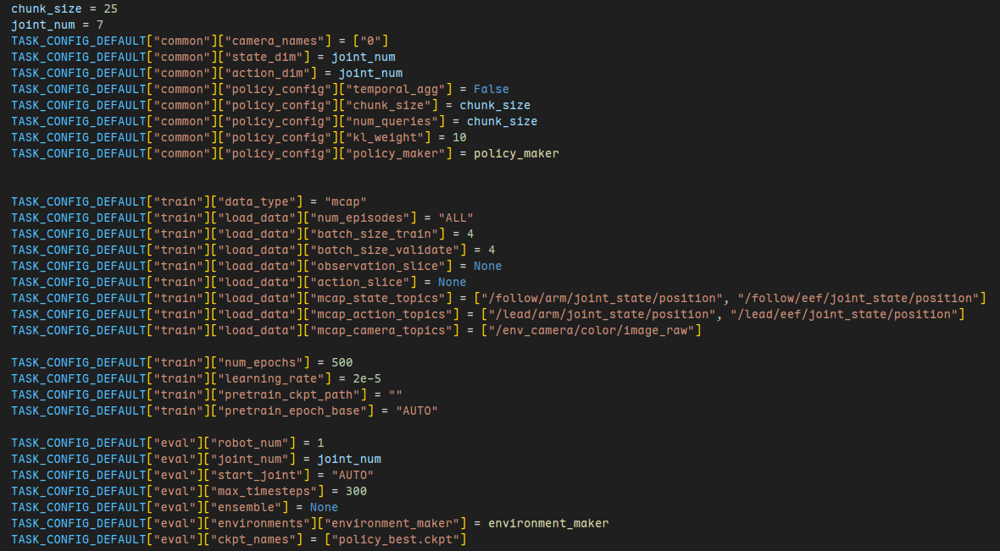
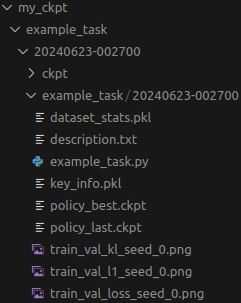
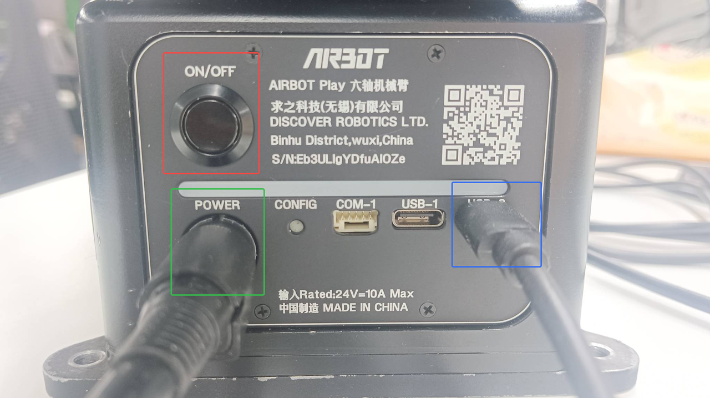
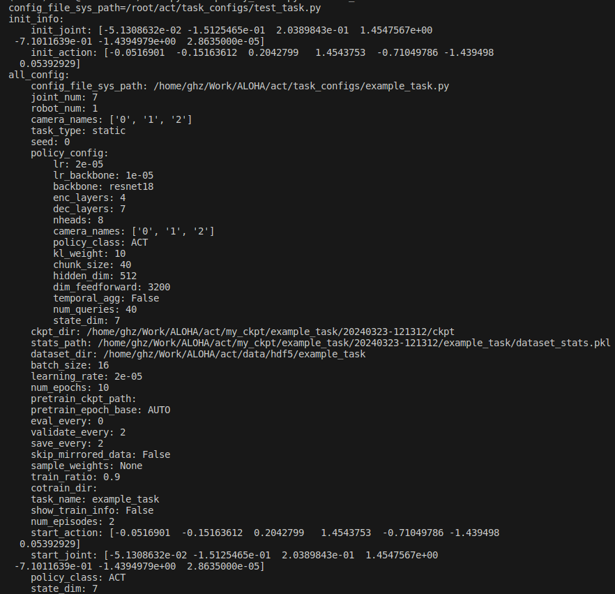

# Imitate All: Imitation Learning Platform For Embodied AI.

## Introduction

This repository contains the codes for configuring, training, evaluating and tuning the models of imitation learning. Make sure your computer has NVIDIA graphics card (memory less than 16G may not be able to train most of the models) and the `nvidia-smi` command is ready (driver installed).

It is recomended to use **anaconda** to manage python environments. You can download and install it by running the following commands(if download very slowly, you can [click here](https://mirrors.bfsu.edu.cn/anaconda/miniconda/Miniconda3-py38_4.9.2-Linux-x86_64.sh) to download manually):

```bash
wget https://mirrors.tuna.tsinghua.edu.cn/anaconda/miniconda/Miniconda3-py38_4.9.2-Linux-x86_64.sh
chmod u+x Miniconda3-py38_4.9.2-Linux-x86_64.sh && ./Miniconda3-py38_4.9.2-Linux-x86_64.sh
```

Restart your terminal and you can now use conda:
```bash
conda config --set auto_activate_base false && conda deactivate
```

## Repo Structure

- `configurations` Configuration files for demonstration, replay, policy training and evaluating
- `data_process` Tools to process data
  - `raw_to_hdf5.py` Examples for converting raw (airbot) data to hdf5 data for training
  - `bson_to_hdf5.py` Examples for converting raw (airbot bson) data to hdf5 data for training
  - `convert_all.py` Tools to process raw data for training
  - `augment_hdf5_images.py` Pipline of augmenting images from the hdf5 file
- `policy_train.py` Policy training: ACT and yours
- `policy_evaluate` Policy evaluating/inferencing: ACT and yours
- `policies`
  - `common` Utils for all policies.
    - `detr` Model definitions modified from policies.common.detr: ACT, CNNMLP
  - `traditional` Traditional policies implementation: cnnmlp
  - `act`&`diffusion` Policy implementation: ACT, Diffusion Policy
  - ``onnx`` Policy by loading a onnx model
    - ``ckpt2onnx`` Example of converting ckpt file to onnx file
    - ``onnx_policy.py`` Load a onnx model as the policy
- `envs` Environments for ``policy_evaluate``: common and AIRBOT Play (real, mujoco, mmk)
- `habitats` Common interfaces, drivers and utils used by robots, envs, etc.
- `images` Images used by README.md
- `requirements` Used for pip install required packages
- `utils` Utils such as data loading and helper functions
- `robots` Robots classes used by the envs
  - `common_robot.py` Example and a fake robot
  - `ros_robots`
    - `ros_robot_config.py` Used to configure the ros robots
    - `ros1_robot.py` General ROS1 robot class used to control the robots
    - `ros2_robot.py` General ROS2 robot class used to control the robots
- `visualize_episodes.py` Save videos from a .hdf5 dataset
- `robot_utils.py` Useful robot tools to record images and process data
- `ros_tools.py` Tools for ROS

## Installation

It is recommended to use a conda python environment. If you do not have one, create and activate it by using the following commands:

```bash
conda create -n imitall python=3.12.8 && conda activate imitall
```

Clone the reposity:

```bash
git clone --depth 1 https://github.com/OpenGHz/Imitate-All.git && cd Imitate-All
```

Install the necessary packages by running the following commands:

```bash
pip install -r requirements/train_eval.txt -i https://pypi.tuna.tsinghua.edu.cn/simple
```

What's more, for policy evaluation, make sure you have set up the robot control environment for both software and hardware, such as AIRBOT Play, TOK2, MMK2 and so on.

## Parameter Configuration

**Before training or inference**, parameter configuration is necessary. **Create a Python file in the ./configurations/task_configs directory with the same name as the task ( not recommended to modify or rename the example_task.py file directly)** to configure the task. This configuration mainly involves modifying various paths (using the replace_task_name function to **use default paths** or manually specifying paths), camera names (camera_names), robot number (robot_num, **set to 2 for dual-arm tasks**), and so on. Below is an example from example_task.py, which demonstrates how to modify configs based on the default configuration in template.py without rewriting everything (for more adjustable configurations, refer to ./configurations/task_configs/template.py):

<p align="center">
  
</p>

When training with default paths, place the .hdf5 data files in the ./data/hdf5/<task_name> folder. You can create the directory with the following command:

```bash
mkdir -p data/hdf5
```

You can then copy the data manually or using a command like this (remember to modify the paths in the command):

```bash
cp path/to/your/task/hdf5_file data/hdf5
```

## Policy Training

> Please complete [Installation](#installation) and [Parameter Configuration](#parameter-configuration) first (training with at least 2 data instances is required; otherwise, an error will occur due to the inability to split the training and validation sets).

Navigate to the repo folder and activate the Conda environment:

```bash
conda activate imitall
```

Then run the training command:

```bash
python3 policy_train.py -tn example_task
```

The above commands, with just `-tn` args, will **use the configurations from the `.py` config files in the `configurations/task_configs` folder corresponding to the given task name**. If you use command-line parameters (not all parameters support command-line configuration, use `-h` arg to show all supported args), they will override the configurations in the config file. This allows for temporary parameter changes but is not recommended for regular use.

After training, by default, you can find two folders in `./my_ckpt/<task_name>/<time_stamp>` directory. The `ckpt` folder contains all weight files (referred to as the **process folder**), while the folder with the same name as `<task_name>` (called the **core folder**) contains the following files:

- Final weights and optimal weights: `policy_best.ckpt` and `policy_last.ckpt` respectively.
- Statistical data: `dataset_stats.pkl`.
- Crucial training information (including initial joint angles, training parameter configurations, etc.): `key_info.pkl`.
- The training loss curves: `train_val_kl_seed_0.png`, `train_val_l1_seed_0.png` and `train_val_loss_seed_0.png`.
- The simple description of the training result: `description.txt`, such as `Best ckpt: val loss 0.174929 @ epoch9499 with seed 0`.

<p align="center">
  
</p>

For ease of use in the future, it's recommended to **store the core folder in the specified disk's IMITALL/my_ckpt folder**.

## Policy Evaluating

> Make sure you have installed the required dependencies for controlling your robots in simulation or reality. The following example shows how to use a AIRBOT Play robotic arm to evaluate a policy.

### Environment Setup
- First, unplug both the teaching arm and execution arm's USB interfaces to refresh the CAN interface. Then, only connect the execution arm's USB interface (this way, the execution arm will use CAN0).
- Connect the cameras in the same order as that of data collection and so if you haven't unplugged them since data collection, you can skip this step.
- Long-press the power button of each robotic arm to turn them on.

<p align="center">
  
</p>

### Check Task Configurations

Policy inference requires the same configuration file as used for training, and the parameters of the inference part need to be adjusted. This mainly includes modify the `environment_maker` funtion and the `TASK_CONFIG_DEFAULT["eval"]` dictionary. Mainly used parameters are explained as follows:

- `robot_num`: The number of the robot, 1 for single Play, TOK and MMK, 2 for dual Plays.
- `joint_num`: The number of the joint for each PlayV2.x robot.
- `max_timesteps`: The total steps for inference during each rollout of the evaluation, usually equal to or slightly larger than the episode length.

### Executing Commands

Navigate to the repo folder and activate the conda environment:

```bash
conda activate imitall
```

Evaluation command and parameters:

- AIRBOT PlayV2.x and TOKv2.x without base

  ```bash
  python3 policy_evaluate.py -tn example_task -ci 0 -ts 20240322-194244
  ```

  - `-ts`: Timestamp corresponding to the task (check the path where policy training results are saved, e.g., ```./my_ckpt/example_task/20240325-153007```).
  - -`ci`: Camera device numbers, corresponding to the device order of the configured camera names. For example, if two cameras are used and their id are 2 and 4, specify `-ci 2 4`.
  - `-can`: Specify which CAN to use for control; default is CAN0. Change to CAN1 with -can can1, for example. For dual-arm tasks, specify multiple cans like ```-can can0 can1```.
  - `-cki`: Don't start the robotic arm, only show captured camera images, useful for verifying if the camera order matches the data collection order.

- AIRBOT PlayV3.x/TOK/MMK
  ```bash
  python3 policy_evaluate.py -tn example_task -cf configurations/basic_configs/example/robot/airbots/tok/airbot_tok_2.yaml
  ```
  
  - `-cf`: The path of the configuration file. The above command specifies the configuration file for TOKv2.x. For PlayV3.x, TOKv3.x and MMK, modify the last parts of the path to `play/airbot_play.yaml`, `tok/airbot_tok.yaml` and `mmk/airbot_mmk.yaml`. You should modify the configurations in the file according to your usage.


After the robotic arm starts and moves to the initial pose defined by the task, you can see the instructions in the terminal: **press Enter to start inference** and press z and then press Enter to end inference and exit. The robotic arm will return to the zero pose before the program exiting.

After each evaluation, you can find evaluation-related files (including process videos) in the corresponding timestamp folder inside the eval_results folder in the current directory.

## Information Viewing

After policy training, key information and dataset stats will be stored in the key_info.pkl file and dataset_stats.pkl, which can be viewed using the following steps.

Navigate to the repo folder and activate the conda environment:

```bash
conda activate imitall
```

Then, use the following command to view information for a specified timestamp:

```bash
python3 policy_train.py -tn example_task -ts 20240420-214215 -in key_info
```

You will see key information related to that task in the terminal, including:

<p align="center">
  
</p>

This includes the absolute path to the HDF5 data used during training, training parameter configurations, initial joint values of the first episode for inference, and other information. 

This information ensures experiment reproducibility. If the camera is rigidly attached to the robotic arm, replicating the robotic arm's behavior is relatively straightforward. Object placement can be determined through retraining data replication.

For dataset stats, just set `-in stats` in the above command.

## Data Collection
Refer to README_DataCollection.md